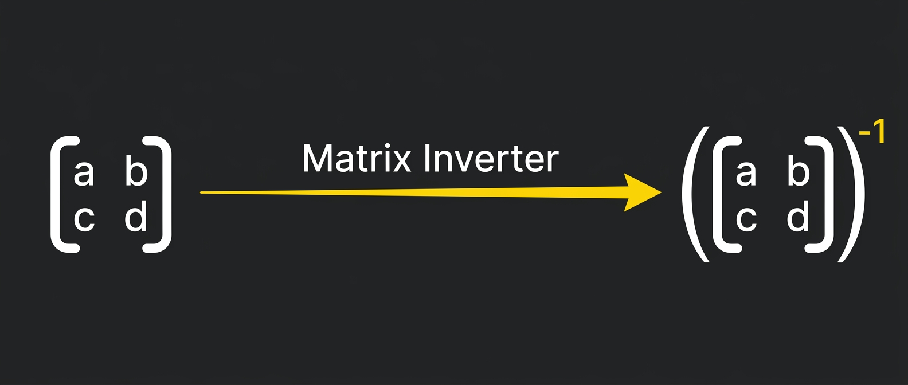

<p align="center">
  <a href="./README.md">English</a> | <b>Русский</b>
</p>

<p align="center">
  
</p>

[](https://en.wikipedia.org/wiki/C11_(C_standard_revision))
[](https://clang.llvm.org/docs/ClangFormat.html)
[](https://opensource.org/license/mit)

[](https://github.com/JohnyDeve/matrix-inverter-c/actions)


[](https://github.com/JohnyDeve/matrix-inverter-c/actions/workflows/clang-format-check.yml)

---

# Matrix Inverter (C implementation)

Консольная утилита на языке C, предназначенная для расчета обратной матрицы HxW с использованием метода **LU-разложение**. Программа ориентирована на надежность, строгую обработку ошибок и эффективное управление памятью.

## Core Features

*   **Algorithm**: Утилита использует **алгоритм LU-разложения** вместо стандартного метода Гаусса-Жордана, обеспечивая более эффективный подход для плотных матриц.
*   **Resource Management**:  В коде используется `Context` подход (удовлетворяющий принципу RAII). Все динамические выделения и файловые дескрипторы инкапсулированы в единую структуру `Context`, что гарантирует отсутствие утечек памяти даже при возникновении критических ошибок.
*   **Error Handling**:  Построен на основе централизованной таблицы кодов состояния. В случае сбоя программа корректно завершает работу через `clear_context`, сообщая конкретное сообщение об ошибке или предупреждении в `stderr`.

## Data Format

Утилита принимает на вход два текстовых файла, а именно:

**Input File (`input.txt`):**
Первая строка должна содержать два целых числа: `height` и `width`. За ними следуют все элементы матрицы.
```text
3 3
1 2 3
0 1 4
5 6 0
```

**Output File (`output.txt`):**
Содержит размеры двумерной матрицы и результирующую обратную матрицу или сообщение `no_solution`, если матрица вырожденная (необратимая).
```text
3 3
-24 18 5 
20 -15 -4 
-5 4 1
```

## Build and Usage

Для компиляции утилиты, необходимо использование компилятора поддерживающего стандарт С11 (Например [GCC](https://gcc.gnu.org/)):

```bash
gcc main.c -o matrix_inverter
```

**Execution:**
```bash
./matrix_inverter input.txt output.txt
```

## Technical Overview

### Error Reporting
В программе используется структурированная система обработки ошибок. Каждое состояние соответствует записи в `status_message_table`.
Пример вывода ошибки в `stderr`:
> `[ERROR]: Executor cannot allocate memory`

### The Context Structure
```c
typedef struct
{
        FILE *input_file;
        FILE *output_file;
        double *mat;
        double *Lmat;
        double *Umat;
} Context;
```
Архитектура позволяет централизованно очищать ресурсы с помощью функции `clear_context(Context *ctx)`.
Это сохраняет логику чистой и позволяет избежать вложенных "if-else" при управлении указателями и дескрипторами файлов.

## Future Improvements
Хотя текущая версия полностью функциональна и стабильна, в будущих версиях запланированы следующие возможности:
- [ ] Поддержка многопоточности для маштабных и тяжелых матриц с использованием POSIX потоков.
- [ ] SIMD-оптимизация для ядра разложения LU.

## Contributing
Помощь контрибьюторов и энтузиастов приветствуются! Если вы нашли ошибку или у вас есть предложения по оптимизации:
1. Сделайте Fork репозитория.
2. Создайте новую ветку (`git checkout -b feature/improvement`).
3. Внесите изменения. (`git commit -m "your description"`)
4. Сделайте Push в новую ветку и откройте Pull Request.

Убедитесь, что любой новый код соответствует существующему `Context`-based подходу обработки ошибок и освобождения памяти. **Для утилиты это важно**

## License
This project is licensed under the **MIT License**. See the [LICENSE](LICENSE) file for more details. 

---
## Contacts & Support

### Author

**Kuzyakin Ivan** — C Developer & System Architect  
Не стесняйтесь обращаться за сотрудничеством или вопросами, касающимися реализации и разработки в целом!

[](https://github.com/JohnyDeve)
[](www.linkedin.com/in/ivan-kuzyakin-1010011100000001010000110000101011011)
[](https://t.me/kuzak1n)

### Support the Project
Если этот инструмент помог или сэкономил вам время, вы можете поддержать его дальнейшее развитие и развитие други проектов от автора:

[](https://www.donationalerts.com/r/kuzakinc)

---
*Made with precision, care and love by JohnyDeve|Kuzak*
